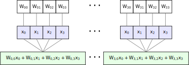

```{r setup, include=FALSE}
knitr::opts_chunk$set(echo = FALSE)
```

# Overview

Building fast neural network inference code ultimately boils down to writing fast matrix multiplications, and NNUEs are no different. However, our NNUEs *must* run efficiently on CPU, which forces us to manually parallelize our inference code in order to remain even somewhat competitive. In this article, I'll walk you through the current state-of-the-art in parallelized NNUE inference, and show how careful SIMD can massively boost your network performance. I'll assume that you know what efficienst updates are, the architectures NNUEs typically have, and how neural network inference is really just matrix-vector multiplication under the hood. Bonus points if you've already got a strong single-layer network.

# Understanding the Concept

## The Trouble with Layer 1

Let's say you've got a single-layer network with the architecture (768 -> 1024)x2 -> 1. This network has two weight matrices --- one with shape 1024x768 for layer 0 (also known as the feature transformer), and the other with shape 1x1024 for layer 1. Computing a forward pass through this network is trivial: you can compute layer 0 using efficient updates, and layer 1 with a simple dot product.

Now let's say you've got a *multi-layer* network, with the architecture of (768 -> 1024)x2 -> 16 -> 32 -> 1. This has four weight matrices, with shapes 1024x768, 16x1024, 32x16 and 1x32 respectively. As before, we can avoid an expensive layer 0 matrix multiplication by using efficient updates, while the layer 2 and 3 multiplications are small enough to not significantly impact performance. This leaves us with layer 1.

Unlike the other layers, layer 1 is neither small nor efficiently updateable, so every forward pass requires $2\times 16\times 1024=32768$ operations! Even though the output dimension is tiny, we still end up spending most of our time here. By contrast, the average layer 0 update requires only $2\times 1024=2048$ operations, despite being much larger. We somehow need to find a way to make layer 1 much cheaper.

## Rewriting the Matrix Multiplication

Let's say you have a 4x4 weight matrix $W$ that you want to multiply with a 4-dimensional vector $x$. Graphically, this looks like the diagram below, where each output entry is given by the dot product of the input vector with a row of the weight matrix. However, computers can't directly store 2D matrices (unless you're on Intel Sapphire Rapids, for some reason), so we need to somehow encode this matrix multiplication in one dimension.


As it turns out, we can represent the matrix in one dimension using *flattening*, which just involves writing each row of the matrix side-by-side to produce one 16-element vector. Since the input vector is now much shorter than the weight vector, let's repeat it until the two vectors match in length --- you'll see why in a moment.

Now that we've lined up the repeated input vector with the weight vector, the matrix-vector product is just the "group-wise dot product" of these two vectors! What do I mean by that? Well, we first multiply "vertically adjacent" elements in the input and weight vector, and then sum over consecutive groups of four to get the final result. The diagram below illustrates this process.



As you can see, repeating the input vector to match the length of the weight vector has given us a *different* way to perform the matrix-vector product, all in one dimension! This is good, because 1D vectors, or *registers*, are exactly what CPUs use to parallelize operations.

## Fewer Bits, Faster Code

So far, I've shown you how to rearrange the matrix-vector product in a way that fits on a CPU register. Since registers are the fundamental unit of SIMD programming, it's good practice to maximize the performance we get out of each one --- the more multiplications we can fit into a single register, the better. Unless you're still on Intel Pentium, your CPU will typically have either 256- or 512-bit wide registers, which would fit 8 or 16 float32s respectively. However, floats are slow, so our first order of business is to use int32s instead. Faster, but we can do better.

The problem is that we're still using four whole bytes to store one integer, which limits the throughput of even the widest 512-bit registers. Instead, we can sacrifice some precision to make our integers smaller --- namely, by shrinking them all the way down to int8. This technique, known as *quantization*, puts us as fast as we can make it on CPU, fitting up to a whopping 64 integers on a single register! Despite the loss in precision, the quadrupled speed more than makes up for it in elo, which, at the end of the day, is all we care about.

## dpbusd: The Perfect Instruction

Now that I've walked you through all the details, it's time to put our lessons into practice. Namely, we need an efficient way to perform a flattened matrix-vector multiplication that fits on one register, using int8 arithmetic. Surely there isn't an instruction that specific, right? Actually, there is! Due to the magic of Intel's obscure VNNI extension, the instruction dpbusd ("dot-product byte unsigned-signed dword") turns out to be exactly what we need for this operation. What does it do? Exactly what I've described so far! It takes in two registers --- one of int8s and the other of uint8s --- and computes the group-wise dot product between successive groups of four integers, finally spitting out a register int32s. But this is just the algorithm shown in Figure [2](#4x4-flattened){reference-type="ref" reference="4x4-flattened"}! So long as one of the input registers contains uint8s, our flattened matrix-multiplication algorithm maps *exactly* onto what dpbusd does under the hood. Looks like layer 1 isn't so troublesome after all.

# Implementation Details

At this point, all that's left is to translate our ideas into code. Specifically, we need to repeat, or *broadcast*, four elements of the input vector across an entire register, and load in the corresponding weights. We also need to make sure one the registers contains unsigned integers, while the other contains signed integers, since this is the format dpbusd expects. Fortunately, since layer 0 ends with a clipped or squared-clipped ReLU, its outputs are always non-negative, so we can safely store them in uint8. Algorithmically, this looks like

```
u8x64 inputs = broadcast(x0 ... x3)
i8x64 weights = load(W_0,0 ... W_15,3)

i32x16 outputs = dpbusd(inputs, weights)
```

## Partitioning the L1 Matrix

You might remember that our original layer 1 matrix had shape 16x1024, and are probably wondering how to implement a matrix-vector product that wide using an algorithm that handles only four inputs at a time. Well, the trick is to *partition* the input matrix into many 16x4 blocks, each of which can be handled by dpbusd, and then sum together the results. This looks like the diagram below, where we're just running dpbusd on each of the $1024/4=256$ tiles and summing the results.


Of course, to actually implement this algorithm, we need to make sure the matrix is stored in a format ready to be tiled, or we'll waste time shuffling the entries before every load. To fix this, we just pre-permute the the matrix at startup, flattening it into blocks of 16x4 entries stored back-to-back. This way, each load is simply the next block in the array.

## AVX2 Considerations

Lastly, its worth noting that VNNI is typically only supported by the latest generation of AVX-512 capable CPUs. If you're on AVX-2, simply replace each call to dpbusd with madd(maddubs(inputs, weights), broadcast(1)), and you're good to go. Happy chessing!


